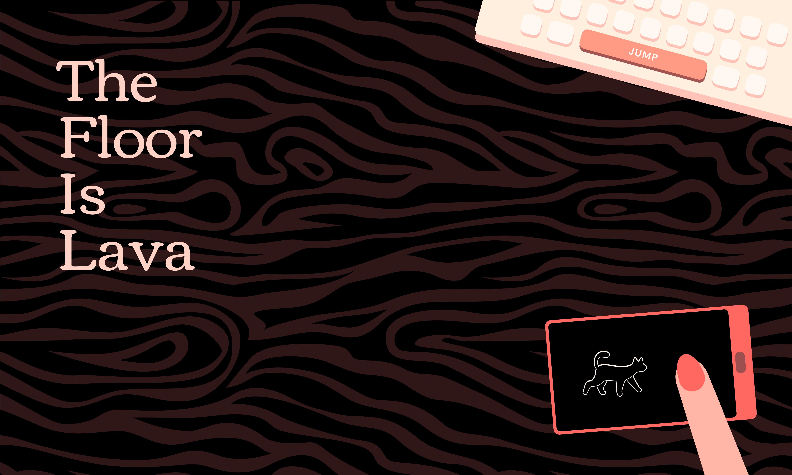

# The Floor Is Lava



The Floor Is Lava es un juego de evitar obstáculos manejando a un gato que debe recorrer diferentes escenarios.

## Equipo

- **Idea original y dirección de arte**: Ester Latorre
- **Artistas**: Ester Latorre, Eva Marco y Paula Tienza
- **Productora**: Paula Tienza
- **Música y Sonido**: Paula Tienza
- **Programadores**: Eva Marco y Aitor Moreno

## Tecnología

- [Taoro](https://github.com/AzazelN28/taoro): Para el desarrollo del juego.
- [Vue](https://vuejs.org): Para la interfaz.
- [Vite](https://vitejs.dev/): Para montar el entorno de desarrollo.

## Instalación

```sh
pnpm install
```

## Desarrollo

```sh
pnpm run dev
```

## Producción

```sh
pnpm run build
```

Si lo vas a desplegar en alguna carpeta puedes utilizar para indicar cuál es la raíz del documento:

```sh
pnpm run build --base=/ruta/base
```

Para probar la versión de producción en local puedes utilizar:

```sh
pnpm run preview
```

Made with :heart: by [The Floor Is Lava Team](#equipo)
